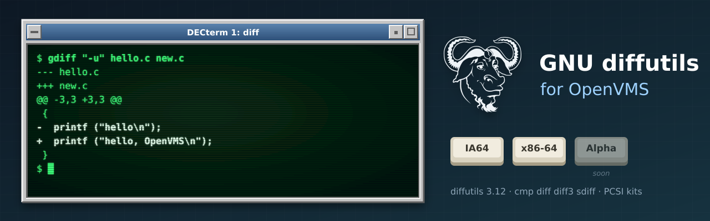

<p align="center">
  
</p>

# GNU diffutils for OpenVMS

[GNU diffutils](https://www.gnu.org/software/diffutils/) (**3.12**): `cmp`, `diff`, `diff3`
and `sdiff`, built natively for OpenVMS on **IA64** and **x86-64**, following diffutils' own
releases. [GNU patch for OpenVMS](https://github.com/issinoho/vms-patch) applies the diffs
it makes. It belongs to the same family as [GNU grep](https://github.com/issinoho/vms-grep),
[GNU sed](https://github.com/issinoho/vms-sed), [GNU
awk](https://github.com/issinoho/vms-awk), [GNU make](https://github.com/issinoho/vms-make),
[GNU m4](https://github.com/issinoho/vms-m4), [GNU
Bison](https://github.com/issinoho/vms-bison), [flex](https://github.com/issinoho/vms-flex),
[GNU Wget](https://github.com/issinoho/vms-wget),
[curl](https://github.com/issinoho/vms-curl), [PCRE2](https://github.com/issinoho/vms-pcre2)
and [zlib](https://github.com/issinoho/vms-zlib) for OpenVMS.

This repository holds **only our changes**: every build starts from the signed GNU release
tarball (Jim Meyering's key, pinned in `keys/`), applies our patches and adds our VMS files.
As for grep, sed and m4, diffutils' own `configure` runs on a Linux host with every compile
and link test sent to VSI C on the node, and MMS builds the result.

## Status

**Released: [v3.12-vms1](https://github.com/issinoho/vms-diffutils/releases/tag/v3.12-vms1).**

| | IA64 (OpenVMS V8.4-2L3, VSI C 7.4) | x86-64 (OpenVMS E9.2-4, VSI C 7.7) |
|---|---|---|
| VSI C configure answers (identical on both but the CPU) | yes | yes |
| Builds | yes | yes |
| Smoke test: identical and different files (statuses), `diff -u`, `cmp`, `diff3` and `diff3 -m`, `sdiff`, `diff -r`, a missing file, no extra version of a redirected `SYS$OUTPUT` | 11/11 | 11/11 |
| Kit install, smoke test on the installed images, remove | clean | clean |
| PCSI kit (`DIFFUTILS`, `V3.12-0E1`) | `ISSINOHO-I64VMS-DIFFUTILS-V0312-0E1-1.PCSI` | `ISSINOHO-X86VMS-DIFFUTILS-V0312-0E1-1.PCSI` |

## Installing the kit

Download the kit for your architecture from the [latest
release](https://github.com/issinoho/vms-diffutils/releases/latest) and check it against the
release's `SHA256SUMS`. A kit downloaded through a non-VMS system loses its record format,
so restore that first, then install it:

```
$ SET FILE/ATTRIBUTE=(RFM:FIX,LRL:8192,MRS:8192,RAT:NONE) ISSINOHO-*-DIFFUTILS-V0312-0E1-1.PCSI
$ PRODUCT INSTALL DIFFUTILS /PRODUCER=ISSINOHO /SOURCE=dev:[dir]
$ @DIFFUTILS$ROOT:[000000]DIFFUTILS$SETUP.COM
```

It installs `CMP.EXE`, `DIFF.EXE`, `DIFF3.EXE` and `SDIFF.EXE` in `[DIFFUTILS.BIN]`;
`DIFFUTILS$SETUP.COM`; the manual (`DIFFUTILS.TXT`), the manual pages, `NEWS`, `COPYING` and
`README.VMS` in `[DIFFUTILS.DOC]`; and `SYS$STARTUP:DIFFUTILS$STARTUP.COM`, which defines
`DIFFUTILS$ROOT` (add it to `SYS$MANAGER:SYSTARTUP_VMS.COM`). `PRODUCT REMOVE DIFFUTILS`
removes it.

## On VMS

- **The commands.** `DIFFUTILS$SETUP.COM` defines `gdiff`, `cmp`, `diff3` and `sdiff`. In
  DCL `DIFF` abbreviates the `DIFFERENCES` command, so `diff` is defined only on request,
  with `$ @DIFFUTILS$ROOT:[000000]DIFFUTILS$SETUP.COM DIFF`; `DIFFERENCES`, typed in full,
  still runs the VMS command.
- **Exit status.** Under DCL, identical files are success; different files (exit code 1) are
  a *warning*, so `IF .NOT. $STATUS` sees the difference but a command procedure's default
  `ON ERROR` does not stop; trouble (2) is an error. Under a GNV shell, `$?` is the exit
  code as on Unix.
- **`diff3` and `sdiff`** run diff in a subprocess (`LIB$SPAWN`) with its output in a
  temporary file in `SYS$SCRATCH`; they use `DIFFUTILS$ROOT:[BIN]DIFF.EXE` unless
  `--diff-program` names another. `sdiff -o`'s `e` command runs the editor named by
  `EDITOR` (default `EDIT`).
- **Not available:** `diff -l` (`--paginate`), which needs the Unix `pr` program.
- **Upper-case options in batch jobs.** Under the TRADITIONAL DCL parse style unquoted
  options reach the programs in lower case: `-B` becomes `-b`. Use the long options, quote
  the short ones (`"-B"`), or `$ SET PROCESS/PARSE_STYLE=EXTENDED` first.

## Patches

| Patch | Purpose |
|---|---|
| 0001 | `lib/dynarray.h`: include the generated `*.gl.h` headers as `*_gl.h` (VSI C cannot include a name with two dots). |
| 0002 | `lib/getprogname.c`: VMS implementation. |
| 0003 | `configure`: look for `struct sched_param` in `<pthread.h>` for host `openvms*`. |
| 0004 | `lib/stdlib.in.h`: route `exit()` through `vms_exit()` for a DCL status of the right severity. |
| 0005 | `lib/config.hin`: let `<assert.h>` define `assert` again (VSI C's header guard). |
| 0006 | `src/diff3.c`: run diff in a `LIB$SPAWN` subprocess with its output in a temporary file. |
| 0007 | `src/sdiff.c`: the same for sdiff, and its editor through `system()`. |
| 0008 | `lib/open.c`: open a directory through gnulib's fallback (`diff -r`). |
| 0009 | `lib/stdio.in.h`: `fwrite()` through `putc()`, so terminal output comes in whole lines. |
| 0010 | `src/diff.c`: end `main` with `exit()`, so the status reaches `vms_exit()`. |

0001-0005 are the gnulib fixes of the m4, sed and Bison ports; 0008 is vms-grep's.

## How to build

Set up `tools/nodes.conf` as described in
[vms-grep's README](https://github.com/issinoho/vms-grep#2b-build-on-vms-from-the-host-over-ssh).

```sh
git clone https://github.com/issinoho/vms-diffutils.git
cd vms-diffutils
tools/vms_configure.sh ia64 # VSI C configure run, about an hour (once per release)
tools/prepare.sh            # fetch + verify, patch, configure with the VSI C answers, MMS lists
tools/build.sh ia64         # upload, then @[.VMS]BUILD on the node (MMS)
tools/test.sh ia64          # smoke test
tools/kit.sh ia64           # PCSI kit -> out/kits/
```

## Roadmap

1. diffutils' own test suite under GNV, as for grep and sed.
2. Offer patches 0006, 0007 and 0010 to diffutils, and the gnulib fixes to gnulib.
3. A port to OpenVMS **Alpha**.

The family of ports, all for IA64 and x86-64, each following its upstream releases:

| Port | Latest release | |
|---|---|---|
| GNU grep — [vms-grep](https://github.com/issinoho/vms-grep) | [v3.12-vms3](https://github.com/issinoho/vms-grep/releases/tag/v3.12-vms3) | with `grep -P` through PCRE2 |
| PCRE2 — [vms-pcre2](https://github.com/issinoho/vms-pcre2) | [v10.49-vms1](https://github.com/issinoho/vms-pcre2/releases/tag/v10.49-vms1) | the regular-expression library |
| GNU sed — [vms-sed](https://github.com/issinoho/vms-sed) | [v4.10-vms1](https://github.com/issinoho/vms-sed/releases/tag/v4.10-vms1) | the stream editor |
| GNU awk (gawk) — [vms-awk](https://github.com/issinoho/vms-awk) | [v5.4.1-vms1](https://github.com/issinoho/vms-awk/releases/tag/v5.4.1-vms1) | built with gawk's own VMS port |
| zlib — [vms-zlib](https://github.com/issinoho/vms-zlib) | [v1.3.2-vms1](https://github.com/issinoho/vms-zlib/releases/tag/v1.3.2-vms1) | the compression library |
| curl — [vms-curl](https://github.com/issinoho/vms-curl) | [v8.22.0-vms1](https://github.com/issinoho/vms-curl/releases/tag/v8.22.0-vms1) | alongside VSI's curl kit, following curl's own releases |
| GNU Wget — [vms-wget](https://github.com/issinoho/vms-wget) | [v1.25.0-vms2](https://github.com/issinoho/vms-wget/releases/tag/v1.25.0-vms2) | the web retriever |
| GNU m4 — [vms-m4](https://github.com/issinoho/vms-m4) | [v1.4.21-vms1](https://github.com/issinoho/vms-m4/releases/tag/v1.4.21-vms1) | the macro processor |
| GNU Bison — [vms-bison](https://github.com/issinoho/vms-bison) | [v3.8.2-vms2](https://github.com/issinoho/vms-bison/releases/tag/v3.8.2-vms2) | the parser generator |
| flex — [vms-flex](https://github.com/issinoho/vms-flex) | [v2.6.4-vms1](https://github.com/issinoho/vms-flex/releases/tag/v2.6.4-vms1) | the scanner generator; runs GNU m4 |
| GNU make — [vms-make](https://github.com/issinoho/vms-make) | [v4.4.1-vms1](https://github.com/issinoho/vms-make/releases/tag/v4.4.1-vms1) | built with make's own VMS port |
| **GNU diffutils** (this port) — [vms-diffutils](https://github.com/issinoho/vms-diffutils) | [v3.12-vms1](https://github.com/issinoho/vms-diffutils/releases/tag/v3.12-vms1) | cmp, diff, diff3, sdiff |
| GNU patch — [vms-patch](https://github.com/issinoho/vms-patch) | [v2.8-vms1](https://github.com/issinoho/vms-patch/releases/tag/v2.8-vms1) | applies diffs |

## Artwork

`docs/images/banner.svg` and `docs/images/icon.svg` were made for this project in the style
of classic DECwindows and VT terminals, like those of its sibling ports. The GNU head is by
Aurelio A. Heckert, used under the terms on <https://www.gnu.org/graphics/heckert_gnu.html>.

## Licence

GNU diffutils is free software under the GNU General Public License, version 3 or later;
see `COPYING`. Our patches and VMS files are distributed under the same terms.

OpenVMS is a trademark of VMS Software, Inc. This project is not affiliated with VMS
Software, Inc. or with the GNU project.
